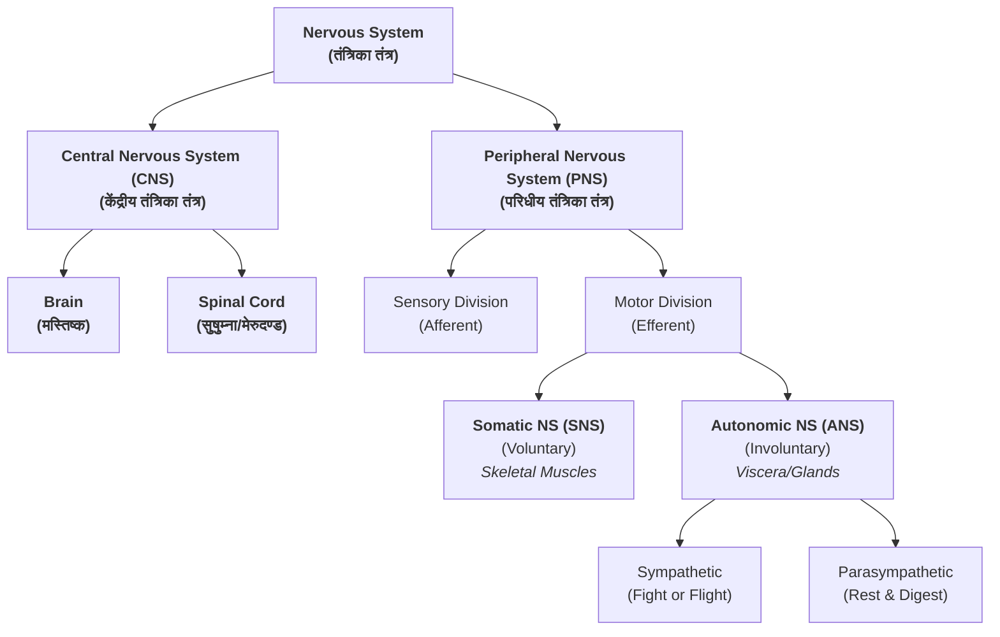

# 📝 Introduction to Nervous System (तंत्रिका तंत्र)

> [!info] Exam Standard: 🎓 BAMS Professional
> **Resolution:** High-Yield Anatomical Precision & Ayurvedic Integration
> **Format:** Exam-Ready Long Answer Protocol

---

## ⚡ Tesla Mental Model: 3D Visualization Protocol
> [!abstract] 🧠 **The Tesla Method**
> *Before memorizing, simulate.*
> Nikola Tesla built machines in his mind before building them in reality.
>
> **Apply this to the Nervous System:**
> 1.  **Visualize:** Close your eyes. See the Brain (मस्तिष्क) not as a picture, but as a glowing, pulsating command center.
> 2.  **Trace:** Watch the electrical signals (प्राण वात) shoot down the Spinal Cord (सुषुम्ना) like lightning striking the ground.
> 3.  **Branch:** See the nerves spreading out like the roots of an inverted Ashwattha tree, touching every inch of skin and muscle.
> 4.  **Feel:** Imagine the sensation of a pinprick—trace the signal *up* the nerve, *into* the spine, *processed* in the brain, and the motor command *firing* back down to pull your hand away.
>
> *Do not proceed until you can run this simulation in your mind's eye.*

---

## 1. Introduction (परिचय)

The **Nervous System (तंत्रिका तंत्र)** is the master controlling and communicating system of the body. It forms the structural basis for all conscious experience, behavior, and physiological regulation.

*   **Sanskrit Term:** तंत्रिका तंत्र
*   **Ayurvedic Correlation:** Primarily governed by **Vata Dosha (वात दोष)**, specifically *प्राण वात* (Head/Brain), *उदान वात* (Throat/Memory), and *व्यान वात* (Circulation/Impulses). The structural entity relates to **Majja Dhatu (मज्जा धातु)**.

**Core Physiological Arc:**
1.  **Sensory Input (ज्ञान/संवेदना):** Receptors detect changes (Stimuli).
2.  **Integration (विचार/मनन):** CNS processes and interprets.
3.  **Motor Output (कर्म/चेष्टा):** Effectors (Muscles/Glands) respond.

---

## 2. Classification of Nervous System (वर्गीकरण)

> [!tip] ✍️ Exam Strategy
> Draw this flowchart immediately in your answer sheet. It provides a skeletal structure for the examiner to follow.

---

## 3. Detailed Component Breakdown

### A. Central Nervous System (CNS) - केंद्रीय तंत्रिका तंत्र
The integration and command center.
*   **Brain (मस्तिष्क):** Situated in the cranial cavity (शिरो गुहा). Seat of *प्राण वात*, *साधक पित्त*, and *तर्पक कफ*.
*   **Spinal Cord (सुषुम्ना नाडी):** Extends through the vertebral column (मेरुदण्ड). Connects brain to the body.

### B. Peripheral Nervous System (PNS) - परिधीय तंत्रिका तंत्र
Communication lines between the CNS and the rest of the body.
*   **Cranial Nerves (कपाल तंत्रिका):** 12 Pairs - Arise from the brain.
*   **Spinal Nerves (मेरु तंत्रिका):** 31 Pairs - Arise from the spinal cord.

### C. Functional Divisions
1.  **Somatic Nervous System (एच्छिक तंत्रिका तंत्र):**
    *   **Control:** Voluntary (चेष्टा).
    *   **Target:** Skeletal Muscles.
    *   **Ayurveda:** Correlates with *वायु* (Initiator of action).
2.  **Autonomic Nervous System (स्वायत्त तंत्रिका तंत्र):**
    *   **Control:** Involuntary (अनिच्छा).
    *   **Target:** Cardiac muscle, Smooth muscle, Glands.
    *   **Subdivisions:**
        *   **Sympathetic:** Prepares body for activity (वात प्रकोप).
        *   **Parasympathetic:** Conserves energy (कफ प्रधानता).

---

## 4. Ayurvedic Perspective (आयुर्वेदीय दृष्टिकोण)

To score high marks, link the anatomy to these concepts:

| Structure/Function | Devanagari |
| :--- | :--- |
| **Nerves** | वात वह नाडी |
| **Brain** | मस्तिष्क / शिरस् |
| **Nerve Impulse** | वात गति / वेग |
| **Sensory Function** | इन्द्रिय अर्थ ग्रहण |
| **Motor Function** | चेष्टा |
| **Tissue Substrate** | मज्जा धातु |

> **Classical Reference:**
> *“वायुः तन्त्र यन्त्र धरः”* (चरक संहिता)
> *Meaning:* Vata Dosha is the sustainer of the structure (Yantra) and function (Tantra) of the body.

---

## 5. Clinical Correlations (व्यावहारिक/निदानात्मक पक्ष)

1.  **Vatavyadhi (वातव्याधि):** Usually refers to neurological disorders (e.g., Paralysis/पक्षाघात).
2.  **Neuropathy:** Damage to peripheral nerves causing numbness/weakness (सुप्तता).
3.  **Sciatica (Gridhrasi - गृध्रसी):** Pain radiating along the sciatic nerve path.
4.  **Epilepsy (अपस्मार):** Abnormal electrical activity in the brain.

---

> [!question] 🧭 **Navigation: What's Next?**
> A) **[[02 - CNS|Deep Dive: Central Nervous System (CNS)]]** - Detailed anatomy of Brain & Spinal Cord.
> B) **[[03 - PNS|Deep Dive: Peripheral Nervous System (PNS)]]** - Cranial & Spinal Nerves structure.
> C) **[[10 - Applied Anatomy|Clinical Pathology]]** - Specific diseases and drugs.
> D) **[[05 - ANS|Autonomic Nervous System]]** - Sympathetic vs Parasympathetic mechanics.

---

## 📚 Active Recall Check
*Close these notes and write down the following:*
1.  Draw the Morphological Classification flowchart from memory.
2.  List the Sanskrit terms for Brain, Spinal Cord, and Nerves.
3.  Explain the "Tesla Visualization" of a nerve impulse.

*Tell me what you missed, and I will add it to the Revision Section.*