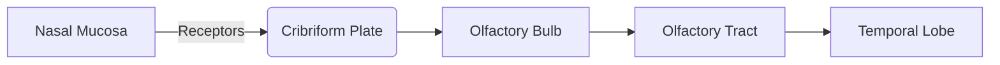

# 📝 Cranial Nerves (12 Pairs)
> [!info] Meta
> **Parent:** [[0 - Academic/🦴 Rachana Sharir/2 - Nervous System/Index|🧠 Nervous System Index]]
> **Tags:** #anatomy #cranial-nerves #mnemonics

---

## 📊 Summary Table

| No. | Name | Origin | Function | Foramen |

| :--- | :--- | :--- | :--- | :--- |

| **I** | Olfactory | Forebrain | Smell | Cribriform Plate |

| **II** | Optic | Forebrain | Vision | Optic Canal |

| **III** | Oculomotor | Midbrain | Eye Movement | Sup. Orbital Fissure |

| **IV** | Trochlear | Midbrain | Eye Movement (SO4) | Sup. Orbital Fissure |

| **V** | Trigeminal | Pons | Sensation, Chewing | SOF, Rotundum, Ovale |

| **VI** | Abducens | Pons | Eye Movement (LR6) | Sup. Orbital Fissure |

| **VII** | Facial | Pons | Expression, Taste | Stylomastoid |

| **VIII** | Vestibulocochlear | Pons | Hearing, Balance | Int. Acoustic Meatus |

| **IX** | Glossopharyngeal | Medulla | Taste, Swallowing | Jugular Foramen |

| **X** | Vagus | Medulla | Viscera, Voice | Jugular Foramen |

| **XI** | Accessory | Medulla | Neck Movement | Jugular Foramen |

| **XII** | Hypoglossal | Medulla | Tongue Movement | Hypoglossal Canal |

> [!tip] Mnemonics

> **Names:** **O**h **O**h **O**h **T**o **T**ouch **A**nd **F**eel **V**ery **G**ood **V**elvet **A**h **H**eaven.

> **Types:** **S**ome **S**ay **M**arry **M**oney **B**ut **M**y **B**rother **S**ays **B**ig **B**rains **M**atter **M**ore. (*S=Sensory, M=Motor, B=Both/Mixed*)

> **Origins:** **2-2-4-4 Rule** (2 Forebrain, 2 Midbrain, 4 Pons, 4 Medulla).

---

## 👃 I. Olfactory Nerve

- **Origin:** Cerebrum (Olfactory Bulb).

- **Type:** Pure Sensory.

- **Function:** Sense of Smell (Olfaction).

- **Pathway:**

- **Clinical:** *Anosmia* (Loss of smell) in fracture of cribriform plate.

## 👁️ II. Optic Nerve

- **Origin:** Diencephalon (Retina -> Thalamus).

- **Type:** Pure Sensory.

- **Function:** Vision.

- **Pathway:**

- **Clinical:** *Anopsia* (Blindness). Pituitary tumors can compress the Chiasm causing Bitemporal Hemianopia (Tunnel vision).

## 👁️ III. Oculomotor Nerve

- **Origin:** Midbrain (Ventral aspect).

- **Type:** Motor.

- **Function:**

    - **Somatic:** Moves 4/6 extraocular muscles (Superior, Inferior, Medial Recti & Inferior Oblique) + Levator Palpebrae Superioris (Lifts eyelid).

    - **Parasympathetic:** Constricts Pupil (Sphincter pupillae) & Accommodation (Ciliary muscle).

- **Clinical:** *Ptosis* (Drooping eyelid), *Squint*, Dilated pupil.

## 👁️ IV. Trochlear Nerve

- **Origin:** Midbrain (Dorsal aspect - Only CN to exit dorsally).

- **Type:** Motor (Smallest cranial nerve).

- **Function:** Supplies **Superior Oblique** muscle.

- **Action:** Depresses and intorts the eye ("Cheater's Muscle" - looking down and in).

- **Clinical:** Diplopia (Double vision) when looking down (e.g., walking downstairs).

## 🦷 V. Trigeminal Nerve

- **Origin:** Pons (Lateral aspect).

- **Type:** Largest Mixed Nerve.

- **Divisions:**

    1.  **V1 Ophthalmic (Sensory):** Forehead, scalp, eye. (Exit: Sup. Orbital Fissure).

    2.  **V2 Maxillary (Sensory):** Cheek, upper lip, upper teeth. (Exit: F. Rotundum).

    3.  **V3 Mandibular (Mixed):** Chin, lower teeth, tongue (sensation), **Muscles of Mastication**. (Exit: F. Ovale).

- **Clinical:** *Trigeminal Neuralgia* (Severe facial pain).

## 👁️ VI. Abducens Nerve

- **Origin:** Pons (Pontomedullary junction).

- **Type:** Motor.

- **Function:** Supplies **Lateral Rectus** muscle.

- **Action:** Abducts the eye (moves it laterally).

- **Clinical:** Medial Squint (Eye turns inward) due to unopposed Medial Rectus.

## 🎭 VII. Facial Nerve

- **Origin:** Pons (Pontomedullary junction).

- **Type:** Mixed.

- **Functions:**

    - **Motor:** Muscles of **Facial Expression**.

    - **Sensory:** Taste from **Anterior 2/3** of tongue.

    - **Parasympathetic:** Lacrimal (Tears), Submandibular & Sublingual Salivary glands.

- **Course:**

- **Clinical:** *Bell's Palsy* (LMN lesion) - facial asymmetry, loss of taste, dry eye.

## 👂 VIII. Vestibulocochlear Nerve

- **Origin:** Pons (Pontomedullary junction).

- **Type:** Pure Sensory.

- **Divisions:**

    1.  **Cochlear Part:** Hearing.

    2.  **Vestibular Part:** Balance (Equilibrium).

- **Clinical:** Vertigo, Nystagmus, Tinnitus (Ringing), Sensorineural Deafness.

## 👅 IX. Glossopharyngeal Nerve

- **Origin:** Medulla Oblongata (Post-olivary sulcus).

- **Type:** Mixed.

- **Functions:**

    - **Sensory:** Taste from **Posterior 1/3** of tongue; Sensation from Pharynx.

    - **Motor:** Stylopharyngeus muscle (Swallowing).

    - **Parasympathetic:** **Parotid Gland** (Saliva).

- **Clinical:** Loss of gag reflex, difficulty swallowing (Dysphagia).

## 🫀 X. Vagus Nerve

- **Origin:** Medulla Oblongata (Post-olivary sulcus).

- **Type:** Mixed (The "Wanderer").

- **Extent:** Longest course (Head to Abdomen).

- **Functions:**

    - **Motor:** Muscles of Larynx (Voice) & Pharynx (Swallowing).

    - **Parasympathetic:** Heart (Slows HR), Lungs (Bronchoconstriction), GI Tract (Peristalsis).

- **Clinical:** Hoarseness of voice (Recurrent Laryngeal N. damage), Dysphagia.

## 💪 XI. Accessory Nerve

- **Origin:** Medulla Oblongata (Cranial Root) & Spinal Cord (Spinal Root).

- **Type:** Pure Motor.

- **Function:** Supplies **Sternocleidomastoid** (Neck turning) & **Trapezius** (Shoulder shrugging).

- **Clinical:** Inability to shrug shoulder or turn neck against resistance.

## 👅 XII. Hypoglossal Nerve

- **Origin:** Medulla Oblongata (Pre-olivary sulcus).

- **Type:** Pure Motor.

- **Function:** Muscles of the **Tongue** (Movement).

- **Clinical:** Tongue deviates to the *affected* side upon protrusion. Difficulty in speech (Dysarthria).
