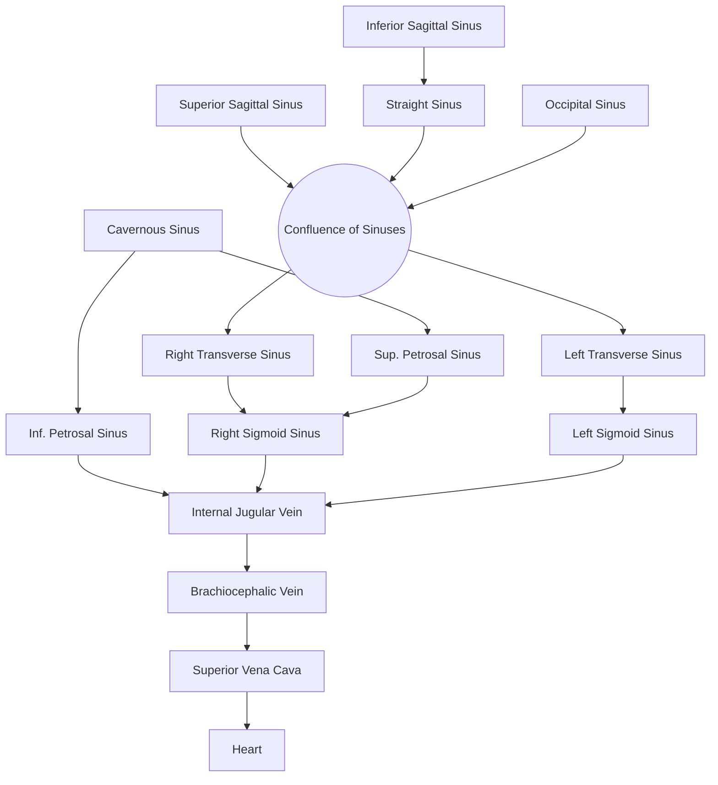

# 🧠 Meninges (Mastishka Avarana) & Dural Venous Sinuses
> [!info] Meta
> **Parent:** [[0 - Academic/🦴 Rachana Sharir/2 - Nervous System/Index|🧠 Nervous System Index]]
> **Tags:** #anatomy #meninges #clinical

> [!info] Quick Summary
> The **Meninges** are three membranous envelopes protecting the brain/spinal cord. The **Dura Mater** is the most complex, forming venous sinuses and rigid folds to partition the brain.
> *Ayurvedic Correlation:* **Mastulunga Avarana** (Brain Coverings) & **Tarpaka Kapha** (CSF).

---

## 🏗️ 1. Dura Mater (Pachymeninx) 🛡️
**Definition:** The Dura Mater (Latin: *Tough Mother*) is the thickest, toughest, and outermost layer of the meninges. It is a dense, inelastic, fibrous membrane derived from Mesoderm (Meningeal layer) and Ectoderm (Endosteal layer) that protects the brain and spinal cord.

### A. Layers (Bilayered)
Unlike the spinal dura (single layer), the Cranial Dura has **two layers**:
1.  **Endosteal (Periosteal) Layer:** 
    *   Outer layer; acts as the **internal periosteum** of the skull bones.
    *   Stops at the Foramen Magnum (does not continue to the spinal cord).
2.  **Meningeal Layer:** 
    *   Inner layer; strong and fibrous.
    *   **Features:**
        *   Forms **4 Folds** (Septa) to divide the cranial cavity.
        *   Forms **Dural Venous Sinuses** (Endothelium-lined spaces between the two layers).
        *   Continues as the spinal dura mater through the Foramen Magnum.

### B. The 4 Dural Folds (Reflections)
*These folds stabilize the brain against rotary displacement.*

| Fold | Shape | Location | Attachments & Borders | Sinuses Contained |
| :--- | :--- | :--- | :--- | :--- |
| **1. Falx Cerebri** | Sickle-shaped | Vertical midline between two Cerebral Hemispheres. | **Apex:** Anterior; attached to *Crista Galli*. **Base:** Posterior; attached to Tentorium Cerebelli. **Upper Border:** Convex; attached to skull vault. **Lower Border:** Concave; free edge. | **Upper:** Superior Sagittal Sinus **Lower:** Inferior Sagittal Sinus **Base:** Straight Sinus |
| **2. Tentorium Cerebelli** | Tent-shaped | Horizontal partition between Cerebrum (Occipital Lobe) & Cerebellum. | **Free Border:** U-shaped; surrounds Midbrain (Tentorial Notch). Attached to Anterior Clinoid Processes. **Attached Border:** Attached to Transverse Sulcus & Petrous Temporal bone. | **Attached Border:** Transverse Sinus & Superior Petrosal Sinus |
| **3. Falx Cerebelli** | Small Sickle | Vertical midline between two Cerebellar Hemispheres. | **Base:** Posterior; attached to Occipital bone. **Apex:** Anterior; at Foramen Magnum. | **Posterior:** Occipital Sinus |
| **4. Diaphragma Sellae** | Circular/Flat | Roof of the Sella Turcica (covers Pituitary Gland). | **Anterior:** Tuberculum Sellae / Anterior Clinoid Processes. **Posterior:** Dorsum Sellae / Posterior Clinoid Processes. **Opening:** Central aperture for Infundibulum (Pituitary Stalk). | **Lateral:** Cavernous Sinuses |

---

## 🩸 2. Dural Venous Sinuses
*Valveless, endothelium-lined channels located between the Endosteal and Meningeal layers of Dura.*

### Classification (Total: 23)
#### 🅰️ Unpaired Sinuses (7) - *Midline*
1.  **Superior Sagittal Sinus:** Upper border of Falx Cerebri.
2.  **Inferior Sagittal Sinus:** Lower border of Falx Cerebri.
3.  **Straight Sinus:** Junction of Falx Cerebri & Tentorium.
4.  **Occipital Sinus:** Attached margin of Falx Cerebelli.
5.  **Anterior Intercavernous Sinus**
6.  **Posterior Intercavernous Sinus**
7.  **Basilar Plexus**

#### 🅱️ Paired Sinuses (8 pairs = 16) - *Lateral*
1.  **Transverse Sinuses (Lateral):** Run in Tentorium Cerebelli.
2.  **Sigmoid Sinuses:** Continuation of Transverse; drain into IJV.
3.  **Cavernous Sinuses:** On either side of Sella Turcica.
4.  **Superior Petrosal Sinuses**
5.  **Inferior Petrosal Sinuses**
6.  **Sphenoparietal Sinuses:** Below the lesser wing of Sphenoid.
7.  **Petrosquamous Sinuses**
8.  **Middle Meningeal Veins**

### 🔄 Blood Flow Pathway (The Drainage Plan)
All dural sinuses ultimately drain into the **Internal Jugular Vein (IJV)**.

---

## 🕸️ 3. Arachnoid Mater (Spider Web)
**Definition:** The Arachnoid Mater (Greek: *Spider-like*) is the delicate, transparent, avascular middle layer of the meninges, named for the spider-web-like trabeculae connecting it to the Pia.

*   **Structure:**
    *   **Avascular:** Does not have its own blood supply.
    *   **Separation:** Separated from Dura by the *Subdural Space* (Potential) and from Pia by the *Subarachnoid Space* (Real, contains CSF).
    *   **Bridges Sulci:** Unlike Pia, it jumps across the sulci (grooves) without dipping in, creating larger subarachnoid spaces known as **Cisterns**.
*   **Key Features:**
    *   **Arachnoid Trabeculae:** Delicate fibrous strands crossing the subarachnoid space to anchor to the Pia.
    *   **Arachnoid Villi:** Microscopic projections into dural sinuses for CSF reabsorption.
    *   **Arachnoid Granulations (Pacchionian Bodies):** Aggregations of Villi that become visible/calcified with age; can cause pitting on the skull bone.
*   **Subarachnoid Cisterns:** (Pools of CSF)
    *   *Cisterna Magna (Cerebello-medullary):* Largest; between cerebellum and medulla.
    *   *Pontine Cistern:* Ventral to Pons.
    *   *Interpeduncular Cistern:* Between cerebral peduncles (contains Circle of Willis).

---

## 🎀 4. Pia Mater (Tender Mother)
**Definition:** The Pia Mater (Latin: *Tender Mother*) is the delicate, highly vascular, innermost layer that adheres intimately to the brain surface.

*   **Structure:**
    *   **Vascular:** Richly supplied with blood vessels.
    *   **Adherent:** Follows the brain contours exactly, dipping deep into every **Sulcus** and **Fissure**.
*   **Key Features:**
    *   **Tela Choroidea:** Folds of Pia mater fusing with the ependyma lining the ventricles to form the **Choroid Plexus** (which produces CSF).
    *   **Perivascular Spaces (Virchow-Robin Spaces):** Pia extends as a sheath around blood vessels entering the brain substance, creating channels for fluid exchange.
    *   **Blood-Brain Barrier:** Acts as a limiting membrane preventing harmful substances from entering the CNS tissue.
    *   **Denticulate Ligaments:** (Spinal Cord Only) 21 pairs of pial extensions anchoring the spinal cord to the dura mater.

---

## 🏥 Clinical & Applied Anatomy

### 1. The Spaces & Hemorrhages
| Space | Location | Content | Pathology | Shape on CT |
| :--- | :--- | :--- | :--- | :--- |
| **Epidural (Extradural)** | Skull ↔ Dura | Middle Meningeal Artery | **Extradural Hemorrhage (EDH)** | **Lens (Biconvex)** 🍋 |
| **Subdural** | Dura ↔ Arachnoid | Bridging Veins | **Subdural Hemorrhage (SDH)** | **Crescent (Moon)** 🌙 |
| **Subarachnoid** | Arachnoid ↔ Pia | **CSF**, Circle of Willis | **Subarachnoid Hemorrhage (SAH)** | **Star/Diffuse** ⭐ |

### 2. Emissary Veins & The "Danger Area"
*   **Definition:** Valveless veins connecting **Extracranial Veins** (Scalp) to **Intracranial Venous Sinuses**.
*   **Role:** Equalize intracranial pressure.
*   **Danger:** Since they are valveless, infection from the scalp (e.g., pimple) can travel inward causing **Cavernous Sinus Thrombosis**.

### 3. Anesthesia & Spaces
*   **Epidural Anesthesia:** Injected into the **Epidural Space** (Fat-filled space in spinal canal). *Note: In the cranium, this space is potential/tight, but in the spine, it is real.*
*   **Spinal Anesthesia (Lumbar Puncture):** Injected into the **Subarachnoid Space** (contains CSF) usually at L3-L4 level to block nerves.

---

## 🌿 Ayurvedic Correlation
*   **Mastulunga Avarana:** The protective layers.
*   **Tarpaka Kapha:** The Cerebrospinal Fluid (CSF) nourished by the membranes.
*   **Sira/Dhamani:** The vascular Pia mater.

> [!tip] Mnemonic for Scalp Layers (SCALP)
> * **S**kin
> * **C**onnective Tissue (Dense)
> * **A**poneurosis (Galea)
> * **L**oose Areolar Tissue (**Danger Zone** - Emissary veins start here)
> * **P**ericranium (Endosteal Dura equivalent)
